# 简易 MEK 流程（从零到核电前）

> 作者: 三途川之影 / 艾可希雅 | 编辑日期: 2024-08-06 00:00:00

## 1. 引言

当你按照原版的生存方式，获得第一个铁镐的时候，就意味着你可以点开通用机械（简称 MEK）的科技树了。你会遇到贯彻整个模组流程最重要的矿物之一——锇（需要用铁镐挖掘），一种白色的矿石。

使用你的合成表查询工具，可以发现你已经可以利用锇作出第一个生产机器——冶金灌注机。但在这之前，还有一些准备工作要做。

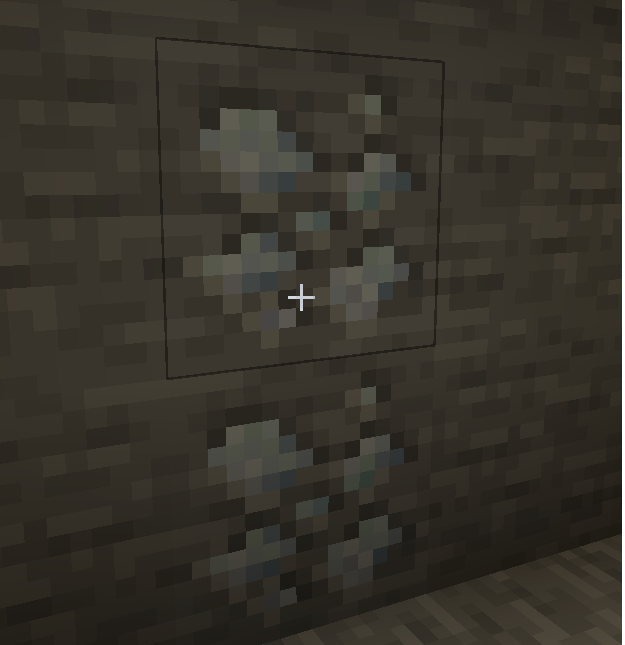

## 2. 前期发电 1——热力发电机进行热电转换

然而此时你的发电选项只有一个——热力发电机(沉浸工程跟交错道途也可以发电)，可以直接使用可燃物进行发电。而还有一套被动发电的原理是，当热力发电机任意一面有熔岩（无论是源头还是流动）时，会产生电力，但因为一个面需要接机器／电线，所以能利用的只有五个面。

温知识：这个机器本身能含岩浆，所以实际上还可以 +1 面，但是一桶岩浆源换约 10 FE / Tick 的发电量，有点麻烦。

下图为一桶岩浆利用发电机五个面进行被动发电的参考例子：

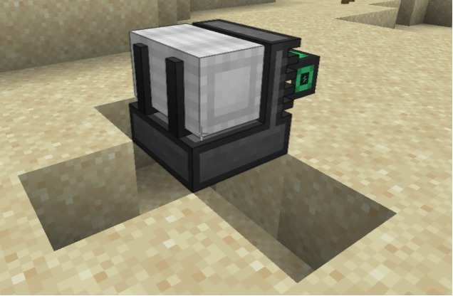

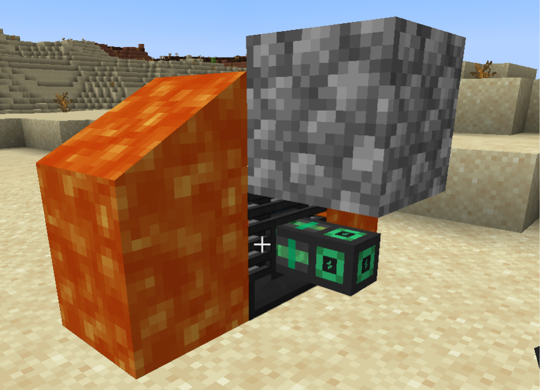

## 3. 万物起源——冶金灌注机

有了电力之后，可以做出你在 MEK 中的第一个生产机器——冶金灌注机。恭喜你，解锁了 MEK 中的合金、控制电路的制作。

> 注：以下一个单位指1个对应物品如碳产生的灌注用液体，富集后对应物品可产生8个单位的灌注用液体。

钢锭：制作大部分 MEK 机械的必需品，在冶金灌注机中，铁锭加1个单位碳变成富集铁，富集铁加1个单位碳变成钢粉，烧炼后变为钢锭。

前期建议先弄6个钢锭，2个用于制作电线，剩下4个用来搓下一个重要机械。

合金：冶金灌注机中一个铁加1个单位的红石可获得最基础的合金，用于制作高级机器。当然利用冶金灌注机可以制作更高级的合金，这点请查询合成表。

控制电路：最基础控制电路由一个锇锭加2个单位红石在冶金灌注机完成。和合金不同的是，它是由更高等级的合金在工作台升级的。

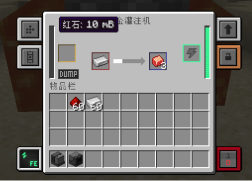

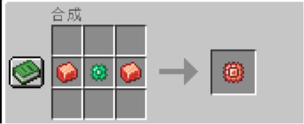

## 4. 一份能当八份用——富集仓

你受够了冶金灌注机不断吞噬着你的红石和煤炭，于是你在合成表发现了一个新机器——富集仓。

将红石和煤炭丢入富集仓进行处理后，得到了富集红石和富集煤，这两个玩意丢入冶金灌注机后可以得到 8 个单位的灌注用液体。

此外另一个重要的功能是，它可以实现前期的矿石增产——粗矿为 3 产 4，原矿为 1 产 2。

另外还有其它配方，例如可以富集沙砾变为燧石，关于这些，请查询合成表。

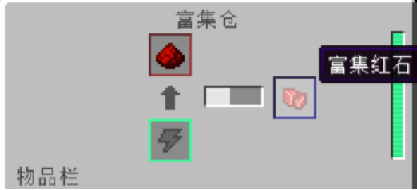

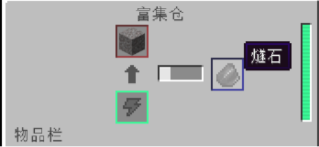

## 5. 前期发电 2——擎天一线，风力发电机

你依照合成表，一步一步制作更高级的合金和控制电路，进而得到了更多的机械，而且使用了速度升级和能量升级来提升机械的工作效率，但电量已经跟不上了。查询合成表后，你找到了自己的下一个目标——风力发电机。

风力发电机的发电效率与高度有关，但就算摆一台在地面上，它的发电效率都是一台被动发电的热力发电机不能比拟的。为了提高效率，你需要提升高度，并且使用电线将电导入下来。

这里推荐搓4～6台，并且把高度提升到300格放置风力发电机，这个的发电量足够你过渡到中期甚至后期，不行再加就是了（doge）。

线缆最低级的就行，或者提升到高级线缆，精英线缆就已经有些浪费了（虽说mek的能量线缆本质上是容量庞大的存储能量的装置）。

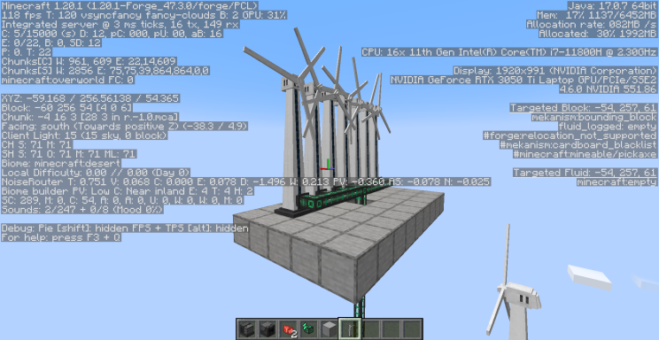

## 6. 升级你的机械工厂——升级组件

即使或已经将机械升级到高级的工厂，但缓慢的进度条成为了提高产能的阻碍，是时候从另一条赛道升级你的机械了。

> 小技巧：可以手持升级组件 `Shift+鼠标右键` 直接安装在机器里。

> 注意：当前版本 MEK 的最大堆叠不是以前的 8 个或 4 个。使用Shift+左键的快捷合成可能会合成过量的升级组件。

能量升级：每个机械能装八个，装到八个的时候用电量是原来的十分之一，电量缓存也会翻十倍。为了你的电量健康，建议先做这个再考虑速度升级。

速度升级：每个机械能装八个，装到八个的时候是十倍速处理(耗电会大大增加)，使用灌注合金、玻璃和锇粉合成。在安装一定量的速度升级后，进电的速度就会小于出电的速度，导致机械无法正常工作，因此建议先拉满上面的能量升级。

降噪升级：没什么好说的，这东西护耳(然而你可以在沉浸工业中直接制作耳罩)。同样是能装八个，装完后就可以使机器完全静音。

其它升级会在对应的机器进行讲解。

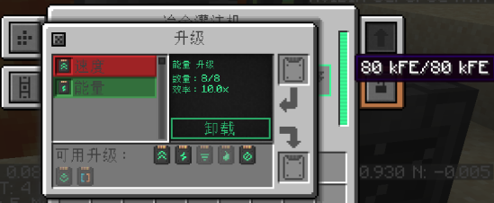

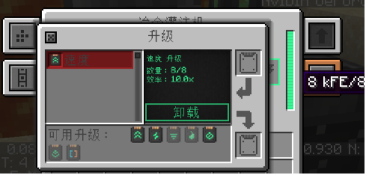

## 7. MEK 的 Kami 们

想要获得轻松的游戏体验，尽快获得数值怪和机制怪是很有必要的。mek提供了十分强大的前期就可以制造的工具。

自由助跑器：甚至只需要最低等级的合金和控制电路就可以制作的脚部装备，有电的情况下可以用电抵消摔落伤害，还可以自动翻越一格高的方块。

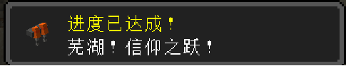

喷气背包：仍然是只需要最低级的控制电路就能制造的飞行工具，需要多造一个电解分离器产生氢气。

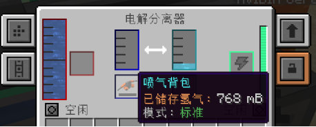

> 注：以上两个工具有对应的切换模式的按键，但建议改一下。
> 
> 而且上述两个工具在获得下界合金锭后可以进行升级，获得对应部位下界合金防御力（甚至不需要升级模板）。

原子分解机：真正的 kami。对无护甲目标高达 21 点的伤害（秒杀苦力怕和无护甲的骷髅），最高档的挖掘速度已经是前期通用机械提供的挖掘速度的极限。如此强大，只需要一个原子合金（最高级的合金）和一个强化黑曜石锭（使用锇压缩机制作）。

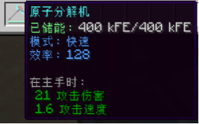

数字型采矿机：这位更是机制怪。然而比起前面几位，这个要贵的多——总计7个原子合金和2个强化黑曜石锭。但可以让你永久摆脱下矿这一工作。采矿机速度慢,要装升级模块.为了被矿我们还需要打开精准采集，这样一来耗电量大大上升了,至少你的产电要2k fe/t以上(包含了被矿产线).

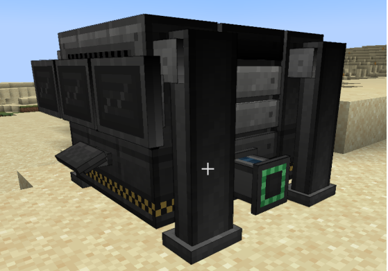